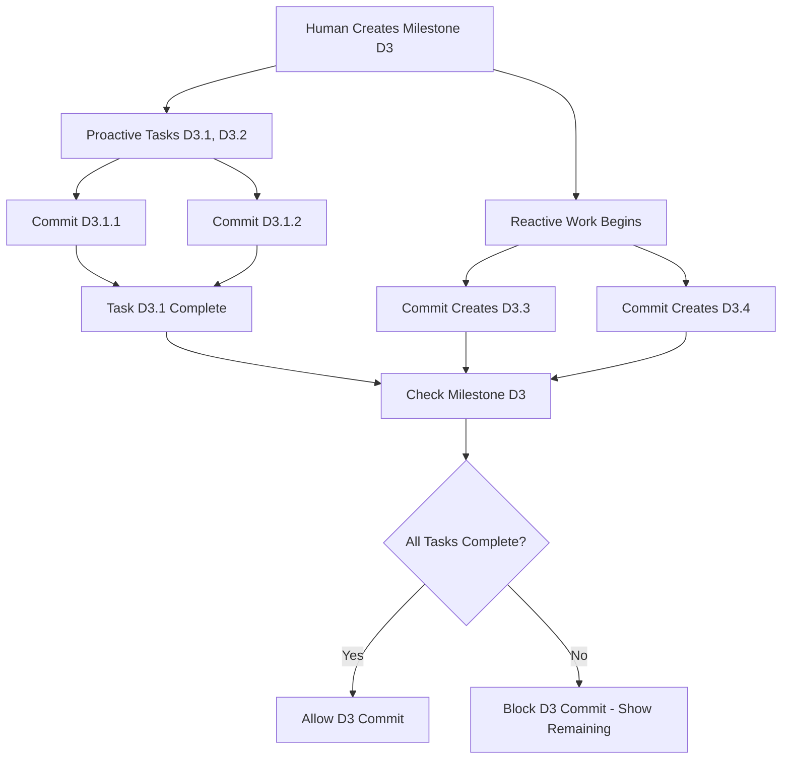

# Spiral Commit System: Hybrid Proactive/Reactive Development

## Problem Statement

### The Challenge: Two Development Paradigms

Modern software development is evolving toward a **hybrid model** where:

1. **Proactive Development** (Human-Driven)
   - Code follows documentation
   - Roadmap-planned work
   - Structured milestone progression
   - Hierarchical task decomposition

2. **Reactive Development** (AI-Agent-Driven)
   - Documentation follows code
   - Emergent work from commits
   - Just-in-time task creation
   - Organic discovery of work scope

### Current Gap

Existing tools force developers into one paradigm or the other. Spiral needs to seamlessly support both while maintaining:
- **Traceability**: Every commit maps to planned or emergent work
- **Validation**: Hierarchical completion checking
- **Context**: Family-scoped commit organization
- **Intelligence**: Automatic roadmap updates from code changes

### Technical Requirements

1. **Intelligent ID Management**: Context-aware ID generation that maintains hierarchy
2. **Commit Validation**: Ensure completeness before marking milestones done
3. **Bidirectional Sync**: Support both plan-then-code and code-then-plan workflows
4. **Family Context**: Organize commits by product family for cross-team visibility
5. **Agent Integration**: Enable AI agents to contribute to roadmaps naturally

## Solution Architecture

### Core ID System Design

```
Family.Milestone.Task.Subtask
  D    .   3    . 1  .   1
  │        │      │       │
  │        │      │       └── Subtask (auto-increment)
  │        │      └────────── Task (auto-increment) 
  │        └───────────────── Milestone (human-assigned)
  └────────────────────────── Family (human-assigned)
```

### Commit Tag Format

```bash
# Milestone commits
git commit -m "[D3] Implement micro-cache layer"

# Task commits  
git commit -m "[D3.1] Add cursor rule validation"

# Subtask commits
git commit -m "[D3.1.1] Research cursor API patterns"

# Reactive commits (auto-generated tasks)
git commit -m "[D3.2] Fix memory leak in cache cleanup"  # Creates D3.2 automatically
```

### Workflow States



## Implementation Design

### 1. Enhanced ID Management

```go
// types/model.go - Enhanced ID structure
type ID struct {
    Family    string  // D, E, F (product families)
    Milestone int     // 3, 4, 5 (major features)
    Task      *int    // 1, 2, 3 (nil for milestone-only IDs)
    Subtask   *int    // 1, 2, 3 (nil for task-only IDs)
}

func (id ID) String() string {
    if id.Subtask != nil {
        return fmt.Sprintf("%s%d.%d.%d", id.Family, id.Milestone, *id.Task, *id.Subtask)
    }
    if id.Task != nil {
        return fmt.Sprintf("%s%d.%d", id.Family, id.Milestone, *id.Task)
    }
    return fmt.Sprintf("%s%d", id.Family, id.Milestone)
}

func (id ID) CommitTag() string {
    return fmt.Sprintf("[%s]", id.String())
}
```

### 2. Commit Validation Engine

```go
// core/validator.go
type CommitValidator struct {
    roadmap *types.Roadmap
    git     *GitRepository
}

func (cv *CommitValidator) CanCommitMilestone(milestoneID string) (*ValidationResult, error) {
    milestone := cv.roadmap.GetMilestoneByID(milestoneID)
    tasks := cv.roadmap.GetTasksByParentID(milestoneID)
    
    result := &ValidationResult{
        CanCommit: true,
        Missing:   []string{},
        Warnings:  []string{},
    }
    
    for _, task := range tasks {
        if !cv.git.HasCommitWithTag(task.ID.CommitTag()) {
            result.CanCommit = false
            result.Missing = append(result.Missing, task.ID.String())
            
            // Check for uncommitted subtasks
            subtasks := cv.roadmap.GetTasksByParentID(task.ID.String())
            for _, subtask := range subtasks {
                if !cv.git.HasCommitWithTag(subtask.ID.CommitTag()) {
                    result.Missing = append(result.Missing, subtask.ID.String())
                }
            }
        }
    }
    
    return result, nil
}
```

### 3. Proactive vs Reactive Workflow Support

```go
// core/commit.go
type CommitMode int

const (
    ProactiveMode CommitMode = iota  // Task exists in roadmap
    ReactiveMode                     // Task created from commit
)

func (c *CommitHandler) SmartCommit(message string, autoMode bool) error {
    // 1. Parse or detect ID from message/context
    commitID, mode := c.determineCommitID(message)
    
    switch mode {
    case ProactiveMode:
        return c.handleProactiveCommit(commitID, message)
    case ReactiveMode:
        return c.handleReactiveCommit(commitID, message, autoMode)
    }
}

func (c *CommitHandler) handleProactiveCommit(id ID, message string) error {
    // Validate task exists in roadmap
    task := c.roadmap.GetTaskByID(id.String())
    if task == nil {
        return fmt.Errorf("task %s not found in roadmap", id)
    }
    
    // Check dependencies if this is a milestone/task completion
    if err := c.validator.ValidateCommit(id); err != nil {
        return fmt.Errorf("validation failed: %w", err)
    }
    
    // Execute git commit with proper tagging
    return c.git.CommitWithTag(id.CommitTag(), message)
}

func (c *CommitHandler) handleReactiveCommit(id ID, message string, autoMode bool) error {
    // Auto-create task in roadmap
    newTask := c.generateTaskFromCommit(id, message)
    
    if autoMode {
        // Add to roadmap automatically
        if err := c.roadmap.AddTask(newTask); err != nil {
            return err
        }
        fmt.Printf("🎯 Auto-created task: %s\n", id)
    } else {
        // Ask user for confirmation
        if !c.confirmTaskCreation(newTask) {
            return fmt.Errorf("task creation cancelled")
        }
    }
    
    // Execute commit
    return c.git.CommitWithTag(id.CommitTag(), message)
}
```

### 4. AI Agent Integration

```go
// core/agent.go - AI Agent interface
type AgentCommit struct {
    CommitSHA   string
    Message     string
    Files       []string
    Confidence  float64  // Agent's confidence in the change
    Category    string   // "bugfix", "feature", "refactor", "test"
}

func (c *CommitHandler) ProcessAgentCommit(agentCommit AgentCommit) error {
    // AI agents work reactively - generate tasks from their commits
    id := c.generateIDFromAgentWork(agentCommit)
    
    // Create task with AI context
    task := types.Task{
        ID:       id.String(),
        ParentID: id.ParentMilestone(),
        Title:    c.extractTitleFromCommit(agentCommit.Message),
        Status:   "done", // Agent already completed the work
        Notes:    fmt.Sprintf("AI-generated from commit %s (confidence: %.2f)", 
                             agentCommit.CommitSHA[:8], agentCommit.Confidence),
        Source:   "agent",
    }
    
    return c.roadmap.AddTask(task)
}
```

## Technical Specifications

### Enhanced CLI Commands

```bash
# Proactive Workflow (Human Planning)
spiral add milestone --id=D3 --title="Micro-Cache Layer"
spiral add task --parent=D3 --title="Add cursor validation"     # Creates D3.1
spiral add subtask --parent=D3.1 --title="Research patterns"    # Creates D3.1.1

spiral commit D3.1.1 --auto                   # Commit existing subtask
spiral commit "Additional validation" D3.1    # Commit to existing task  
spiral commit D3 --validate                   # Commit milestone (with validation)

# Reactive Workflow (AI/Emergent Work)
spiral commit "Fix memory leak in cache cleanup" --auto
# 🎯 Auto-detected context: D3 (Micro-Cache Layer)
# ✅ Created task: D3.2 - Fix memory leak in cache cleanup
# ✅ Created commit: [D3.2] Fix memory leak in cache cleanup

spiral commit "Add unit tests for cache" --auto  
# ✅ Created task: D3.3 - Add unit tests for cache
# ✅ Created commit: [D3.3] Add unit tests for cache

# Validation and Status
spiral validate D3                             # Check milestone readiness
spiral show missing D3                         # Show uncommitted work
spiral show agent-work                         # Show AI-generated tasks
```

### Validation Rules

```yaml
# .spiral/validation.yml
validation_rules:
  milestone_completion:
    require_all_tasks: true
    require_all_subtasks: true
    allow_orphan_commits: false
    
  task_completion:
    require_all_subtasks: true
    allow_partial_completion: true
    
  commit_format:
    require_family_prefix: true
    validate_id_exists: proactive_only
    auto_create_reactive: true
    
  agent_integration:
    confidence_threshold: 0.7
    require_human_review: false
    auto_assign_to_current_milestone: true
```

### Example Validation Output

```bash
$ spiral commit D3 --validate

🔍 Validating milestone D3: Micro-Cache Layer
=====================================

✅ D3.1 - Add cursor validation [COMMITTED: abc123f]
   ✅ D3.1.1 - Research patterns [COMMITTED: def456a] 
   ✅ D3.1.2 - Implement validation [COMMITTED: 789bcd]

❌ D3.2 - Fix memory leak [MISSING COMMIT]
   ⚠️  Work completed but not committed

❌ D3.3 - Add unit tests [MISSING COMMIT]
   🤖 AI-generated task, needs human review

❌ Cannot commit milestone D3: 2 tasks uncommitted

💡 Complete these first:
   spiral commit D3.2 --title="Fix memory leak in cache cleanup"
   spiral commit D3.3 --review  # Review AI-generated work
```

## Workflow Examples

### Scenario 1: Proactive Development (Human-Led)

```bash
# 1. Human plans milestone
spiral add milestone --id=D4 --title="Advanced Caching" --priority=high

# 2. Human breaks down tasks
spiral add task --parent=D4 --title="Implement TTL expiration"     # D4.1
spiral add task --parent=D4 --title="Add cache statistics"        # D4.2

# 3. Human works through subtasks
spiral add subtask --parent=D4.1 --title="Design TTL algorithm"   # D4.1.1
spiral commit "TTL algorithm implementation" D4.1.1

# 4. Complete task
spiral commit D4.1  # Auto-validates D4.1.1 committed

# 5. Complete milestone  
spiral commit D4 --validate  # Ensures D4.1, D4.2 all committed
```

### Scenario 2: Reactive Development (AI-Led)

```bash
# 1. AI agent makes commits during development
git commit -m "Optimize cache lookup performance"
git commit -m "Fix race condition in cache eviction"
git commit -m "Add prometheus metrics for cache hits"

# 2. Spiral processes AI commits reactively
spiral sync-agent-work
# 🤖 Detected 3 uncommitted changes
# ✅ Created D4.3 - Optimize cache lookup performance
# ✅ Created D4.4 - Fix race condition in cache eviction  
# ✅ Created D4.5 - Add prometheus metrics for cache hits

# 3. Human reviews and commits milestone
spiral show D4
spiral commit D4 --validate
```

### Scenario 3: Hybrid Workflow

```bash
# Human starts with plan
spiral add milestone --id=D5 --title="Cache Persistence"
spiral add task --parent=D5 --title="Redis integration"  # D5.1

# AI discovers additional work needed
spiral commit "Add connection pooling for Redis" --auto
# ✅ Created D5.2 - Add connection pooling for Redis

spiral commit "Handle Redis failover scenarios" --auto  
# ✅ Created D5.3 - Handle Redis failover scenarios

# Human completes planned work
spiral commit D5.1

# Human reviews and commits milestone with AI contributions
spiral validate D5
spiral commit D5
```

## Implementation Priority

### Phase 1.5: Enhanced ID Management
- [x] ~~Basic ID structure~~ ✅ Complete
- [ ] Family-prefixed IDs (D3, E4, F2)
- [ ] Hierarchical validation
- [ ] Smart ID generation

### Phase 2: Smart Commit System  
- [ ] Git integration with tag parsing
- [ ] Proactive commit validation
- [ ] Reactive task creation
- [ ] Completion checking

### Phase 3: AI Agent Integration
- [ ] Agent commit processing
- [ ] Confidence scoring
- [ ] Human review workflows
- [ ] Bulk sync capabilities

This system bridges the gap between traditional human-driven planning and emerging AI-driven development, creating a unified roadmap that evolves naturally with both paradigms. 